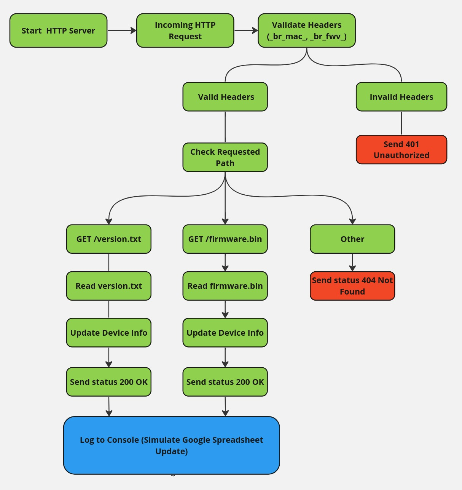

# OTA Server

This is a simple HTTP server used for OTA updates for devices. The server logs the following information:

- Last Seen Time
- Update Time
- Current Firmware Version
- Device MAC address

# Tasks and Time Estimates

1. **Design architecture and setup development environment**
   - Design the project architecture, set up the development environment, and install necessary dependencies.
   - **Time**: 1.5 hours

2. **Implement the functionality**
   - Implement the OTA server functionality, including handling version check and firmware download requests, collecting device information, and logging data.
   - **Time**: 2.5 hours

3. **Prepare unit tests**
   - Prepare and write unit tests to verify the main functions and request handlers.
   - **Time**: 1 hour

4. **Code Refactor**
   - Refactor the code to improve readability, maintainability, and performance.
   - **Time**: 1 hour

5. **Make manual end-to-end testing and add detailed documentation to the README file**
   - Perform manual end-to-end testing to verify the overall functionality, and add detailed documentation to the README file, including setup, running, and testing instructions.
   - **Time**: 1 hour

### Total Estimated Time: 7 hours


## Block Diagram of the Program Logic



## Setup

1. **Clone the repository**:
   ```bash
   git clone https://github.com/ruslan-kornich/ota_server.git
   cd ota_server
   ```

2. **Create and activate a virtual environment:**:

```bash
    python -m venv venv
    source venv/bin/activate  

   ```

3. **Install dependencies:**:

 ```bash
   pip install -r requirements.txt 

   ```

# Running the Server

To start the server, run the following command:

```bash
   python -m ota_server.server

   ```

The server will start on port 7777 by default.

You can also run on a custom port by specifying the flag --port {port}

Example: 

```bash
   python -m ota_server.server --port 8000
   
   ```
# Testing the Server

## Running Tests

To run the tests, use the following command:

```bash
   python -m unittest discover
   ```

The tests will automatically find a free port and run the server on that port to avoid conflicts with the main server.

# Using the OTA Server

## Check Firmware Version

To check the firmware version, use the following curl command:

```bash
   curl -X GET http://localhost:7777/version.txt \
     -H 'cache-control: no-cache' \
     -H 'Connection: close' \
     -H '_br_mac_: 00:11:22:33:44:55' \
     -H '_br_fwv_: v1.0.0'


   ```

This request should return the contents of the version.txt file.

## Download Firmware

To download the firmware, use the following curl command:

```bash
   curl -X GET http://localhost:7777/firmware.bin \
     -H 'cache-control: no-cache' \
     -H 'Connection: close' \
     -H '_br_mac_: 00:11:22:33:44:55' \
     -H '_br_fwv_: v1.0.0'
   ```

This request should return the contents of the firmware_<version>.bin file.

# File Locations

- Version File: ota_server/version/version.txt
- Firmware Files: ota_server/firmware/firmware_<version>.bin

Ensure these files exist in their respective directories for the server to function correctly.

# Logging

The server logs information about each device's interaction:

- Last Seen Time: When the device last checked the firmware version.
- Update Time: When the device last updated its firmware.
- Current Firmware Version: The current firmware version of the device.
- MAC: The MAC address of the device.

# Handling Signals

The server handles shutdown signals (e.g., SIGINT for Ctrl+C) gracefully, ensuring all threads are properly terminated.

